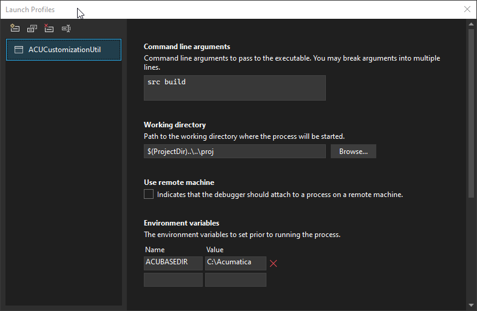

# Acumatica Customization Util (ACU)

Current version:

URL to download:
### General info
Acumatica Customization Utility (ACU) is a utility designed to automate everyday routine tasks related to the creation and maintenance of built-in applications (customization packages) of ERP Acumatica.

ACU is a CLI application that implements a system of commands that are intuitively structured according to their functional purpose and allow you to perform conveniently the necessary actions when creating and maintaining customization packages. A complete description of all available commands and their corresponding options can be found in the ACU Reference.xlsx document.

ACU allows to perform the following actions (by groups of commands):
* ERP: download of installation package of the required version, install of ERP Acumatica (supports installation of multiple versions), delete of ERP Acumatica.
* Site: install the Acumatica instance, upgrade instance or database, delete the Acumatica instance.
* Src: get the source code of the customization package from the instance, build the extension library code, make the customization package (three modes are supported - normal, build for ISV, build for QA).
* Pkg: upload and publish custom packages to the site, get the package from the site, unpublish all packages.

### Project structure
```powershell
ACUCustomizationUtil
├───doc                              Project documentation
├───proj                             Test project
│   ├───cst
│   ├───pkg
│   └───src
│       └───ACUCustomization
└───src
    └───ACUCustomizationUtil         Main project
        ├───Builders
        │   ├───Commands             Commands
        │   │   ├───Binders          Parameter binders
        │   │   └───Common
        │   ├───DI                   DI
        │   └───Log                  Logger
        ├───Common
        ├───Configuration            Code for Configuration by services
        │   ├───ACU
        │   ├───Erp
        │   ├───Package
        │   ├───Site
        │   └───Src
        ├───Connected Services       SOAP Service
        │   └───AcuSOAP
        ├───Extensions               Extention methods
        ├───Helpers                  Command helpers
        │   ├───CommonTypes
        │   └───Proxy
        ├───JSON                     JSON custom converters
        ├───Properties
        ├───Services                 Command Services
        │   ├───ERP
        │   ├───Package
        │   ├───Site
        │   └───Src
        └───Validators               Command Validators
            ├───Erp
            ├───Package
            ├───Site
            └───Src
```
### Documentation

 - [ACU User Guide](doc/ACUUserGuide.md)
 - [ACU Command Reference](doc/ACUCommandReference.md)
 - [ACU Configuratoin Reference](doc/ACUConfigurationReference.md)
 - [ACU Project Configuration Guide](doc/ACUProjectReference.md)

### Settings required to work with the Test Project
The solution includes a test project ACUCustomization, which is located in the folder proj.
The Test project is a typical customization project and allows developer to add new functionality or debug in the ACUCustomizationUtil code without being distracted by the creation of additional test conditions.
Below are the profile settings required to work with the test project:

_VisualStudio_



_JetBrains Rider_


