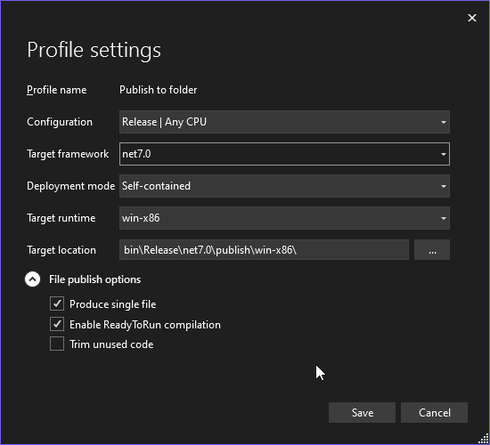

# Acumatica Customization Util (ACU)

## Package Guide (version 23.9.14.22375)

To create a package using the development environment, you need to set up the corresponding configuration. 
Let's consider setting up the corresponding configurations for JetBrains Rider and Visual Studio step by step.

### Create package from JetBrains Rider

1. Start the IDE and open the ACUCustomizationUtil solution.
2. Open the configuration menu, click Edit Configurations ....


3. In the opened window select + -> NET Publish -> Publish to folder


4. Fill in the values marked with numbers in the screenshot.

### Create package from Visual Studio

1. Start the IDE and open the ACUCustomizationUtil solution.
2. Open the public profile menu, click "New Profile"


3. In the opened window select Folder->Next -> Next -> Folder->Next


4. Fill in the value, Target Folder location, click Finish.


5. Click Show all settings, fill in the values in the dialog box that opens and click Save.



### Result
If we now run the created configuration, we should see the following files in the specified directory
```powershel
PS C:\VS\ACUCustomizationUtil\AcuCustomizationUtil\bin\Release\net7.0\win-x86\publish> ls

    Directory: C:\VS\ACUCustomizationUtil\AcuCustomizationUtil\bin\Release\net7.0\win-x86\publish

Mode                 LastWriteTime         Length Name
----                 -------------         ------ ----
-a---           9/15/2023  6:09 PM          43513 acu.dll.config           dll configuration file 
-a---           9/15/2023  6:09 PM       80521918 acu.exe                  utility executable
-a---           9/14/2023  1:23 PM           1064 acu.json                 sample configuration file
-a---           9/15/2023  6:09 PM          64072 acu.pdb                  PDB (program database file), contains information for the debugger to work with
```