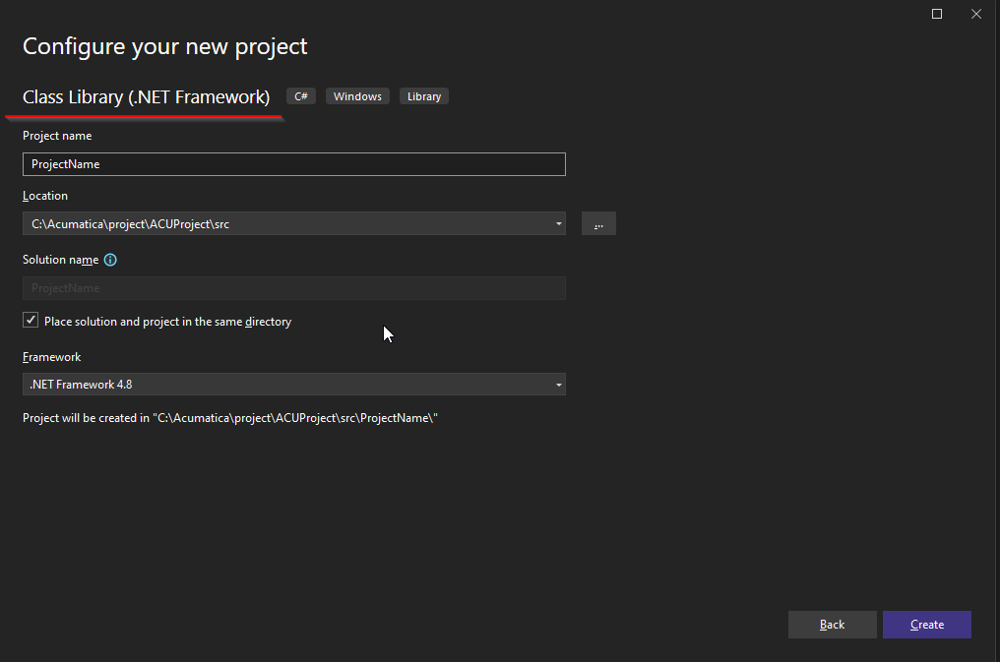

# Acumatica Customization Util (ACU)

## Project Configuration Guide (version 23.10.3.29702)

### Introduction

This guide will discuss two ways of organizing projects. We will call them "classical" and "modern".
A classic project is a project organized according to the principle of naming directories in accordance with the convention, with each folder name strictly tied to the content stored in it. It was used together with CstCustomizationUtil development automation tool.
A modern project is a project organized in the form of folders named in accordance with the developer's common sense notions. Such projects are automated by ACUCustomizationUtil. The ACUCustomizationUtil configuration allows you to customize the configuration for any project organization, as flexibly as possible, without any rules or conventions. 

The main problem in organizing any customization project is the presence of dependencies in it (plug-in libraries, ERP and Acumatica instance installation paths, etc.). With teamwork, such constraints can be solved in three ways:

- Project catalogs and paths to plug-in resources and to ERP & Acumatica instance are identical and rigidly defined.
- Project catalogs are rigidly defined, paths to pluggable resources and to the Acumatica ERP & instance are configured as relative (relative to the main project catalog).
- Project catalogs, as well as paths to pluggable resources, to ERP & Acumatica instance are configured as computable parameters.

The first method is the easiest, but it is also completely inflexible. Let's just note it and move on to the remaining two.
The second method is quite workable and requires minimal configuration. However, the main problem with this approach is the inability to create and use Acumatica instances as shared resources between projects. Thus, it was necessary to deploy a separate Acumatica instance for each customization project, which is redundant. This way uses the "classic" method.
The third approach seems to be the most promising. The only problem is the seeming complexity of the configuration at first. The advantages are the flexibility and minimalism of the configuration, the ability to use previously installed Acumatica instances as shared resources between projects.

> If a project is created from scratch, it must be created in a modern style.

> Classically styled projects should be converted according to these guidelines in order for them to use ACUCustomizationUtil.

### Structure of directories and files

* Classic project
```powershell
ProjectName                         root folder
    ├───ProjectName                 project C#, extension library
    ├───ProjectName.package         customization project package
    └───ProjectName.source          customization project source code
	.gitignore                      ignore rules for Git
	acu.json                        ACUCustomizationUtil config file
	Directory.Build.props           shared parameters for all solution projects
	ProjectName.sln                 solution file
	README.md                       solution information
```

* Modern project
```powershell
ProjectName
├───cst                             customization project  source code
├───pkg                             directory for customization packages
└───src                             project C#, extension library
    └───ProjectName
	.gitignore						ignore rules for Git
	acu.json						ACUCustomizationUtil config file
	Directory.Build.props			shared parameters for all solution projects
	ProjectName.sln					solution file
	README.md						solution information
```

### Project creation
1. Create a root folder for the project. The folder name is usually the same as the project name.  
2. Create a project of Class Library (.NET Framework) type in the ProjectName or src directory:  
    
3. Create **Directory.Build.props** file in the root project folder:  
    _Directory.Build.props_
    ```xml
    <Project>
        <PropertyGroup>
            <TargetFramework>net48</TargetFramework>
            <SiteDir>C:\Acumatica\instance\23.105.0016\Site</SiteDir> 
        </PropertyGroup>
    </Project>
    ```
4. Replace path to the site in `<SiteDir>` tag to match yours.
    > This is where the **SiteDir** variable is defined. The value of this variable should point to the Acumatica instance for which the customization is being developed. The value of the **SiteDir** variable is used in the project file as a substitute for the path to the Acumatica instance.
5. Change all references to the Site to use `$(SiteDir)` variable:
    _{ProjectName}.csproj_  
    ```xml
      <ItemGroup>
        <Reference Include="PX.Common, Version=1.0.0.0, Culture=neutral">
          <SpecificVersion>False</SpecificVersion>
          <HintPath>$(SiteDir)\Bin\PX.Common.dll</HintPath>
        </Reference>
        <Reference Include="PX.Data, Version=1.0.0.0, Culture=neutral">
          <SpecificVersion>False</SpecificVersion>
          <HintPath>$(SiteDir)\Bin\PX.Data.dll</HintPath>
        </Reference>
        <Reference Include="PX.Objects, Version=1.0.0.0, Culture=neutral">
          <SpecificVersion>False</SpecificVersion>
          <HintPath>$(SiteDir)\Bin\PX.Objects.dll</HintPath>
        </Reference>
      </ItemGroup>
    ```
6. Add a BeforeBuild rule to set the build version when using MSBuild:  
    _{ProjectName}.csproj_  
    ```xml
    <Target Name="BeforeBuild">
      <ItemGroup>
        <AssemblyAttributes Include="AssemblyVersion">
          <_Parameter1>$(Version)</_Parameter1>
        </AssemblyAttributes>
      </ItemGroup>
      <MakeDir Directories="$(IntermediateOutputPath)" />
      <WriteCodeFragment Language="C#" OutputFile="$(IntermediateOutputPath)Version.cs"  AssemblyAttributes="@(AssemblyAttributes)" />
      <ItemGroup>
        <Compile Include="$(IntermediateOutputPath)Version.cs" />
      </ItemGroup>
    </Target>
    ```
7. Add a PostBuildEvent section to copy the project assembly to the instance directory after each successful project build:  
    _{ProjectName}.csproj_  
    ```xml
    <PropertyGroup>
      <PostBuildEvent>
          xcopy /F /Y $(TargetPath) $(SiteDir)\Bin\
          xcopy /F /Y $(TargetDir)$(TargetName).pdb $(SiteDir)\Bin\
      </PostBuildEvent>
    </PropertyGroup>
    ```
8. Add NuGet package `Acuminator.Analyzers to the project:  
    _{ProjectName}.csproj_  
    ```xml
    <ItemGroup>
      <Analyzer Include="..\..\packages\Acuminator.Analyzers.3.1.2\analyzers\dotnet\cs\Acuminator.Analyzers.dll" />
      <Analyzer Include="..\..\packages\Acuminator.Analyzers.3.1.2\analyzers\dotnet\cs\Acuminator.Utilities.dll" />
    </ItemGroup>
    ```
    > You can add `Acuminator.Analyzers` using NuGet Package Manager UI in Visual Studio

9. Move the Solution file (`{ProjectName}.sln`) to the root project folder
10. Edit the path to the Extension Library project in the solution file.

### Transforming a classic project to using ACUCustomizationUtil
1. Identify the version of Acumatica ERP in use
2. Delete the CstCustomizationUtil directory with all its contents.
3. Remove the reference to the Acumatica instance from the solution file
4. Follow the steps described in the "Changes to the project" section of this manual
5. Add the acu.json configuration file and configure the parameters for the current customization project.
If it is necessary to switch the project to use a common Acumatica instance
6. Using the Acumatica utility of the appropriate version, delete the Acumatica instance that the project is running with
7. Make changes in the acu.json file: sections erp & site
8. Delete the ProjectName.webapp directory
