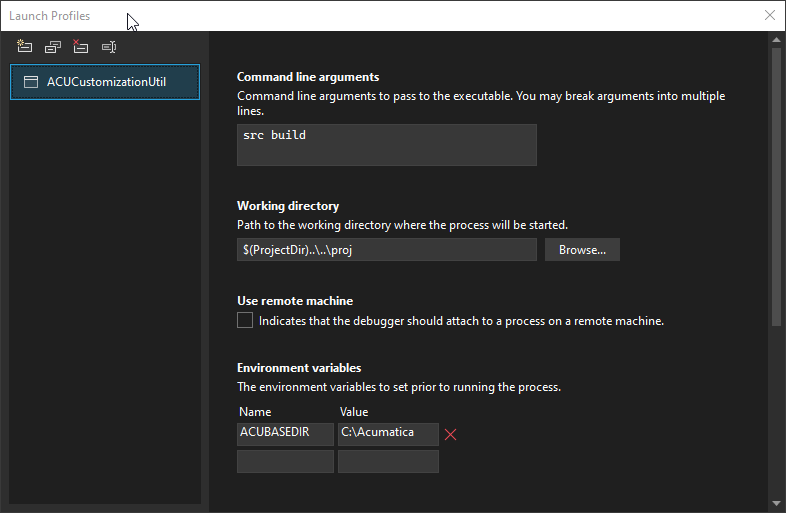
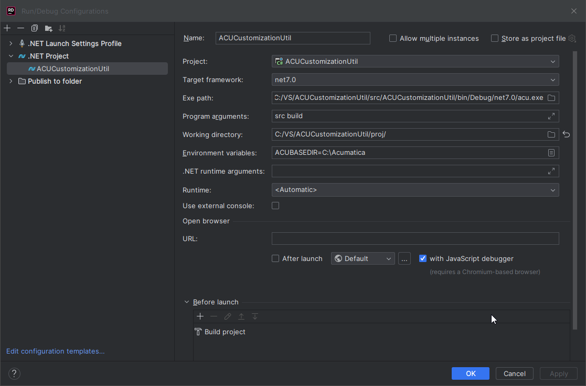

# Acumatica Customization Util (ACU)

## ACU Test Project Guide (version 23.9.14.22375)

The test project is a typical customization project and allows developer to add new functionality or debug in the ACUCustomizationUtil code without being distracted by the creation of additional test conditions.
Below are the profile settings required to work with the test project:

_VisualStudio_

_JetBrains Rider_

