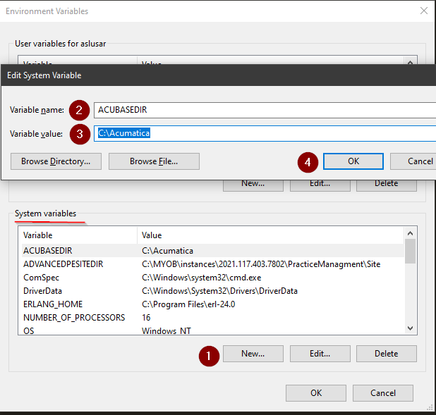
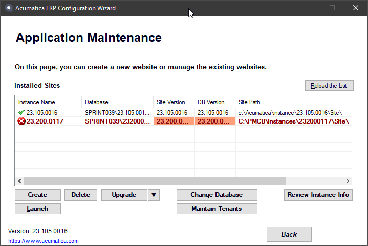
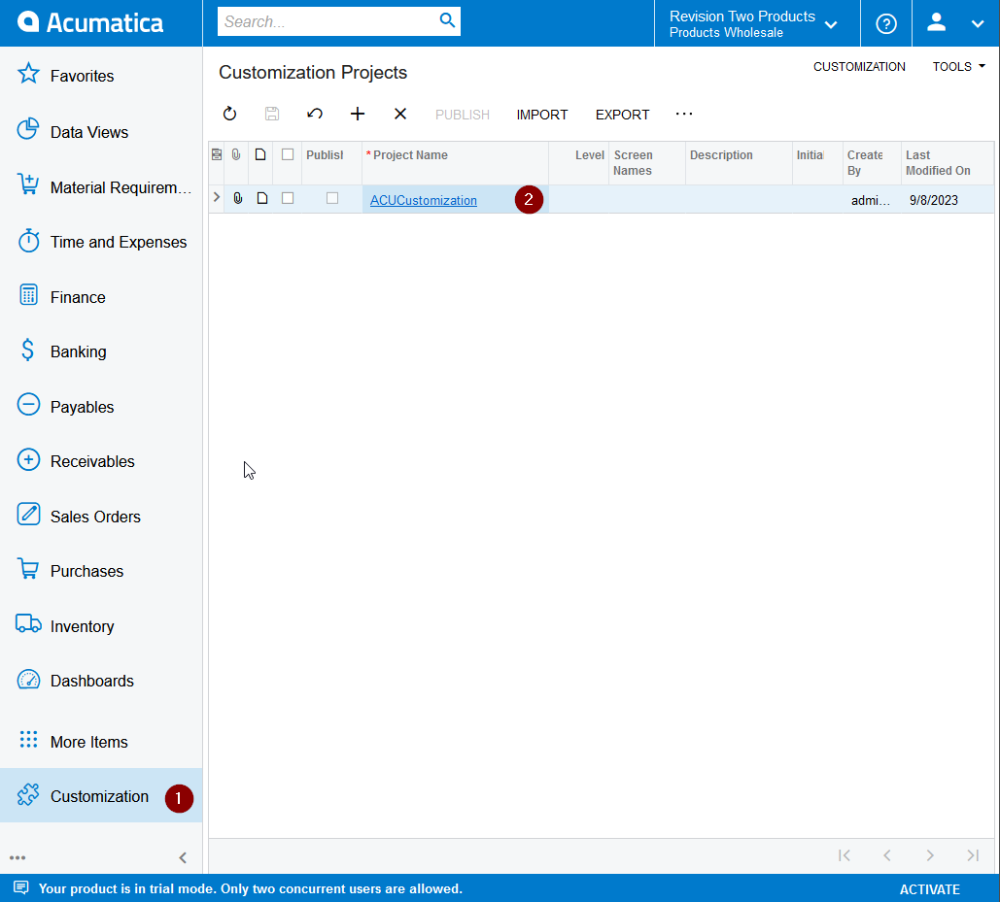
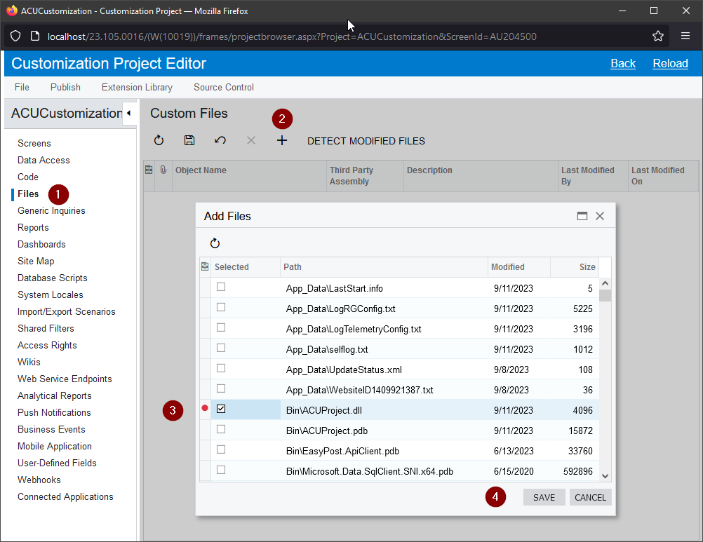
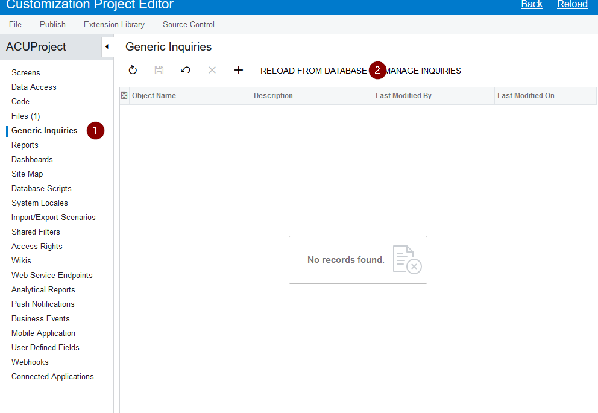

# Acumatica Customization Util (ACU)

## User Guide (version 23.10.17.38782)

### General information

Acumatica Customization Utility (ACU) is a utility designed to automate everyday routine tasks related to the creation and maintenance of built-in applications (customization packages) of ERP Acumatica.

ACU is a CLI application that implements a system of commands that are intuitively structured according to their functional purpose and allow you to perform conveniently the necessary actions when creating and maintaining customization packages. A complete description of all available commands and their corresponding options can be found in the ACU Reference.xlsx document.

ACU allows to perform the following actions (by groups of commands):

- **ERP**:	_download_ of installation package of the required version, _install_ of ERP Acumatica (supports installation of multiple versions), _delete_ of ERP Acumatica.
- **Site**:	_install_ the Acumatica instance, _upgrade_ instance or database, _delete_ the Acumatica instance.
- **Src:**	_get_ the source code of the customization package from the instance, _build_ the extension library code, _make_ the customization package (three modes are supported - normal, build for ISV, build for QA).
- **Pkg**:	_upload_ and _publish_ custom packages to the site, _get_ the package from the site, _unpublish_ all packages.

### Installation

The customization package can be obtained from:

[Sprinterra Google Drive](https://drive.google.com/drive/folders/1K9JcIMjdnBsRxzI_VMFoBacPAH_vbU5t?usp=sharing)

The ACUCustomizationUtil folder contains versions of the utility in folders with name corresponding to the version.

You should select the most recent version of the utility and copy the contents of the folder to your PC, for example, to the folder C:\\Users\\ %USERNAME%\\ACU. After that, you need to add the folder with the utility to the variable Path of the environment;

Next, you need to check that the utility is working correctly: start PowerShell and run the **acu** /? command.

The output should be similar to the one shown in the image.

```
PS C:\VS\ACUCustomizationUtil\src\ACUCustomizationUtil> acu /?
Acumatica customization util - tool for work with customization
Copyright Sprinterra(c) 2023

Usage:
  acu [command] [options]

Options:
  --config <config>            An option of path to configuration file [default: acu.json]
  --user-config <user-config>  An option of path to user configuration file [default: acu.json.user]
  --version                    Show version information
  -?, -h, --help               Show help and usage information

Commands:
  erp   Work with a Acumatica ERP.
  site  Work with a Acumatica instance.
  src   Work with a source code of customization.
  pkg   Work with a customization package.
```

### Configuration

The ACU configuration includes the following items:

The main configuration file, which is given by the global option -config, the default name is acu.json, JSON format;

User configuration file, given by --user-config option, default name is  acu.json.user, JSON format;

Configuration options for the corresponding command.

The complete information on the configuration file parameters is presented in the [ACU Configuration Reference](ACUConfigurationReference.md), the information on command options is presented in the [ACU Command Reference](ACUCommandReference.md).

When using the utility, it is not necessary to set the acu.json  &  acu.json.user in command prompt files each time using the --config and --user-config options, these options only need to be used when using files with **not default** names .

To use the configuration it is enough to create and place the acu.json and (if necessary) acu.json.user files in the customization root directory.

The command options are used when using the utility without configuration files or for one-time modification of the configuration when executing a command.

When using two or three configuration items at the same time, the command option has the highest priority, the acu.json file has the lowest priority

For example, with this configuration, the final value will be C:\\Acumatica\\Sites\\AcutestUtil

|acu.json|acu.json.user|command option|
|--------|-------------|--------------|
|site.instancePath|site.instancePath|--instancePath|
|C:\\ACU\\instances\\AcuTestUtil|D:\\ACU\\inst\\AcuTestUtil|**C:\Acumatica\Sites\AcutestUtil"**|

In configuration files, values are written as “parameter_name”:”value”

If the value of the parameter is not defined, you should use this entry

```
“parameter_name”: null
```

The double backslash, \\\\, must be used as a path separator for files and directories;

```
"instancePath": "C:\\Acumatica\\instance\\23.105.0016\\Site",
```

A relative path (relative to the current directory) can be specified like this: folder\\\\subfolder.

```
"pkgSourceDirectory": "cst",
```

System or User environment variables can be used in the parameters that indicate the path to something:

```
erp": {                                                               Parameters for erp command
    "erpVersion": "23.105.0016",                                      ERP Version
    "installationFileName": "AcumaticaERPInstall.msi",                Installation file name
    "destinationDirectory": "%ACUBASEDIR%\\erp"     <-------------->  Destination directory
    "url": null,                                                      URL for download ERP installer
  },
```

List of such parameters

- `destinationDirectory`
- `instancePath`
- `packageDirectory`
- `pkgSourceDirectory`
- `msBuildSolutionFile`
- `msBuildTargetDirectory`

### Built-in help system

The utility contains a built-in help system. For each command, you can view a list of its subcommands and parameters. Options for calling help are -?, -h, --help

For example,

Show the initial section of the help system;

```
PS C:\VS\ACUCustomizationUtil\src\ACUCustomizationUtil> acu /?
Acumatica customization util - tool for work with customization
Copyright Sprinterra(c) 2023

Usage:
  acu [command] [options]

Options:
  --config <config>            An option of path to configuration file [default: acu.json]
  --user-config <user-config>  An option of path to user configuration file [default: acu.json.user]
  --version                    Show version information
  -?, -h, --help               Show help and usage information

Commands:
  erp   Work with a Acumatica ERP.
  site  Work with a Acumatica instance.
  src   Work with a source code of customization.
  pkg   Work with a customization package.
```

Show the help system section on the erp command;

```
PS C:\VS\ACUCustomizationUtil\src\ACUCustomizationUtil> acu erp /?
Acumatica customization util - tool for work with customization
Copyright Sprinterra(c) 2023

Usage:
  acu erp [command] [options]

Options:
  --config <config>            An option of path to configuration file [default: acu.json]
  --user-config <user-config>  An option of path to user configuration file [default: acu.json.user]
  -?, -h, --help               Show help and usage information

Commands:
  download  Download ERP installation.
  install   Install ERP.
  delete    Delete ERP.
```

Show the help section on the download command of the erp command

```
PS C:\VS\ACUCustomizationUtil\src\ACUCustomizationUtil> acu erp download /?
Acumatica customization util - tool for work with customization
Copyright Sprinterra(c) 2023

Usage:
  acu erp download [options]

Options:
  --erpVersion <erpVersion>                      ERP version
  --destinationDirectory <destinationDirectory>  Base directory for install ERP
  --installerName <installerName>                Name of ERP installer file [default: AcumaticaERPInstall.msi]
  --url <url>                                    ERP installer download url
  --config <config>                              An option of path to configuration file [default: acu.json]
  --user-config <user-config>                    An option of path to user configuration file [default: acu.json.user]
  -?, -h, --help
```

### Logging

When running, the utility creates log files in the directory where the utility is launched from.

Log files are named as acu-log\[yyyyMMdd\].txt, where \[yyyyMMdd\] is the variable part and indicates the date the file was created.

The log file has the following format:

```
Date        UTC Time    Local    Type Message

2023-09-05 15:40:20.882 +03:00 [INF] Execute InstallErp action
2023-09-05 15:40:20.902 +03:00 [INF] Reading configuration
2023-09-05 15:40:20.904 +03:00 [INF] Current configuration parameters:
2023-09-05 15:40:20.905 +03:00 [INF] [Erp] Url : "http://acumatica-builds.s3.amazonaws.com/builds/23.1/23.105.0016/AcumaticaERP/AcumaticaERPInstall.msi"
2023-09-05 15:40:20.907 +03:00 [INF] [Erp] ErpVersion : 23.105.0016
2023-09-05 15:40:20.907 +03:00 [INF] [Erp] InstallationFileName : AcumaticaERPInstall.msi
2023-09-05 15:40:20.908 +03:00 [INF] [Erp] DestinationDirectory : C:\Acumatica\erp
2023-09-05 15:40:20.909 +03:00 [INF] Validate configuration
2023-09-05 15:40:20.929 +03:00 [INF] Starting installing ERP to C:\Acumatica\erp\23.105.0016
2023-09-05 15:41:11.905 +03:00 [INF] Install ERP success
```

### Working with the utility

The typical scenarion when working with Acumatica ERP customizations are:

1. Creating a customization project from scratch.
2. Deploying the existing project.

If in the first case, the automation of routine tasks is not a critical factor determining the time spent on creating a project from scratch, then in the second case, deployment automation is a critical condition that directly affects the time for which the programmer will be ready to work with the project.

Consider the operation of the utility on these examples.

#### Creating a customization project from scratch

##### Customization project folders structure:

<u>Classic style</u>:

The most of the implemented Sprinterra projects use the following directory structure:

```
ProjectName                         root folder
    ├───ProjectName                 project C#, extension library
    ├───ProjectName.package         customization project package
    ├───ProjectName.source          customization project source code
    └───ProjectName.webapp          Acumatica instance for customization
```

This was because the previous CI/CD automation tool was based on convention and the structure and naming of directories was the basic principle.

The same structure can continue to be used for existing customization projects, the ACU can be easily configured to work with any directory builder.

<u>Modern style:</u>

For new projects, you can create an arbitrary structure of folders, for example:

```
ProjectName
├───cst                                customization project  source code
├───pkg                                directory for customization packages
└───src                                project C#, extension library
    └───ProjectName
.gitignore
acu.json
Directory.Build.props
ProjectName.sln
README.md
```

As you can see, there is no directory for deploying an instance here. And this is natural, because ACU allows not only to install the Acumatica instance in any directory convenient for the user, but also to configure customization projects for sharing instances of the required versions.

##### Create new project

For create new project from scratch, developer should do next steps:

1. Create repository for project and clone it into project root folder.
2. Create User or System Environment variables if necessary.
3. Create folder structure for customization.
4. Copy acu.json file into project root folder and edit according to you requirements.
5. Check if the desired version of ERP is installed, download and install ERP if necessary.
6. Check if the desired version of Acumaticza instance is installed, install  Acumatica site if necessary.
7. Create solution for customization extension library.
8. Make customization package.
9. Upload and publish customization package.
10. Get customization package source.
11. Commit changes into repository.

Consider these steps in more detail.

For simplicity and clarity of presentation, we agree that we will operate with the following variables :

- Repository name:                                    **ACUProject**
- Project name:                                       **ACUProject**
- Base path for ERP & Instance installation:          **C:\\Acumatica**
- Base path for customization project:                **C:\\Acumatica\\project**
- Environment Variable for Base path:                 **%ACUBASEDIR%**
  
##### Create repository for project and clone it into project root folder

After the repository is created, you need to go to the Base folder of the customization project and clone repository

```powershell
PS C:\Acumatica> cd C:\Acumatica\project
PS C:\Acumatica\project> git clone --progress -v https://[!!!YOU USERNAME!!!]@bitbucket.org/sprinterraacumatica/acuproject.git ACUProject
```

##### Create User or System Environment variables if necessary

Open Environment Variables editor and create **ACUBASEDIR** System variable  



##### Create folder structure for customization

 Create folders for customization project items - open PowerShell and run next commands:

```powershell
PS C:\Acumatica\project> mkdir cst
PS C:\Acumatica\project> mkdir pkg
PS C:\Acumatica\project> mkdir src
PS C:\Acumatica\project> tree
ACUProject
├───cst
├───pkg
└───src
```

##### Copy acu.json file into project root folder and edit according to you requirements

Copy example asu.json file from ACU installation folder into Base project folder and edit it according to your requirements. Since the file should be placed in the root catalog of the customization project, the paths to some folders can be set as relative paths. The fully configured file for project ACUProject can be seen below:

```json
{
  "erp": {    
    "erpVersion": "23.105.0016",
    "installationFileName": "AcumaticaERPInstall.msi",
    "destinationDirectory": "%ACUBASEDIR%\\erp",
    "url": null
  },
  "site": {
    "instanceName": "23.105.0016",
    "instancePath": "%ACUBASEDIR%\\instance\\23.105.0016\\Site",
    "sqlServerName": "localhost",
    "dbName": "23.105.0016DB", 
    "acumaticaAdminName": "admin",
    "acumaticaAdminPassword": "123",
    "dbConnectionString": null,
    "acumaticaToolPath": null,
    "iisAppPool": null,
    "iisWebSite": null
  },
  "pkg": {
    "url": "http://localhost/23.105.0016/api/ServiceGate.asmx",
    "login": "admin",
    "password": "123",    
    "pkgName": "ACUProject",
    "pkgDirectory": "pkg",
    "tenant": null
  },
  "src": {
    "pkgSourceDirectory": "cst",
    "pkgLevel": "0",
    "msBuildSolutionFile": "ACUProject.sln",
    "msBuildTargetDirectory": "src\\ACUProject\\bin\\Release",
    "msBuildAssemblyName": "ACUProject.dll",
    "makeMode": null,
    "pkgDescription": null
  }
}
```

##### Download and install ERP

Check if your ERP system has the required version of Acumatica ERP installed. To do this, look at the contents of the directory specified in the erp.destinationDirectory parameter of the configuration file. For version "23.105.0016" the directory listing should look like this

```powershell
Acumatica
└───erp
    └───23.105.0016
        └───Acumatica ERP
```

If ERP is not installed, install it.
To do this, run the following commands:

```powershell
PS C:\Acumatica\project\ACUProject> acu erp download
PS C:\Acumatica\project\ACUProject> acu erp install
```

##### Install Acumatica instance

Check that you have an Acumatica instance installed on your system that matches the configuration parameters in the configuration file. To do this, run the configuration utility **AcumaticaConfig.exe** (For our case it will be located in the C:\Acumatica\erp\23.105.0016\Acumatica ERP\Data directory).



If Acumatica instance is not installed, install it.
To do this, run the following command:

```powershell
PS C:\Acumatica\project\ACUProject> acu site install
```

##### Create solution for customization extension library

Create a project for the Extention Library. How to properly create such a project is described in the [ACU Extension Library Reference](ACUProjectReference.md) document.
After the project for Extension Library is created, check if it can be built using the CLI. Run the command
```powershell
PS C:\Acumatica\project\ACUProject> acu src build
```
##### Create customization package and configure it

Follow the steps below to create a customization project

1. Open http://localhost/23.105.0016 in your browser and log in.
2. Open the "Customization Projects" screen
3. Delete all demo projects and click the save button
4. Add a new project and name it according to the configuration requirements (ACUProject).



5. Open the project in the customization editor, go to the "Files" menu item, click "+" and add the Extensikon Library assembly (ACUProject.dll) to the project



6. Publish the customization project
   
##### Get customization package source
To get the customization source code, run the command
```powershell
PS C:\Acumatica\project\ACUProject> acu src get
```
Сheck the customization source code folder. It should look something like this:

```powershell
C:\Acumatica\project\ACUProject
├───cst
│   ├───Bin
│   │       ACUProject.dll
│   │
│   └───_project
│           ProjectMetadata.xml
```

##### Check ability to create, upload and publish customization package from CLI
Check if you can build packages using the ACU CLI. Run the commands:
```powershell
PS C:\Acumatica\project\ACUProject> acu src make
```
If the commands are successful, you will see the file ACUProject.zip in the pkg folder.

Check if you can build packages with the build number in the name. 
Run the command
```powershell
PS C:\Acumatica\project\ACUProject> acu src make --mode QA
```
If the commands run successfully, you will see a file like this ACUProject\[23.105.0016\]\[23.105.23911.1401\].zip in the pkg folder.
The numbers in brackets mean the following 
- \[23.105.0016\] - Full version of ERP, 
- \[23.105.23911.1401\] - Major version of ERP, year, month, day, hour, minute of the build 
This file can be deleted

Check the ability to publish customizations using the ACU CLI. Run the commands:
```powershell
PS C:\Acumatica\project\ACUProject> acu pkg upload
PS C:\Acumatica\project\ACUProject> acu pkg publish
```
##### Checking the result
After all manipulations, the ACUProject folder should look as follows:
(some files and directories removed from the view for better readability)

```powershell
C:\Acumatica\project\ACUProject>
├───cst
│   ├───Bin
│   │       ACUProject.dll
│   └───_project
│           ProjectMetadata.xml
├───pkg
│       ACUProject.zip
└───src
    └───ACUProject
   .gitignore   
   acu.json
   ACUProject.sln
   Directory.Build.props
```
##### Commit changes into repository
The repository should include files from the folders shown in the figure above.
Add the following rules to the **.gitignoire** file:
```gitignore
acu-log*.txt
/pkg/*.zip
bin
obj
Debug
Release
.vs
```
Check the list of files that will go into the repository. It should be something like this:
```powershell
PS C:\Acumatica\project\ACUProject> git status
On branch develop
Your branch is up to date with 'origin/develop'.

Changes to be committed:
  (use "git restore --staged <file>..." to unstage)
        modified:   .gitignore
        new file:   ACUProject.sln
        new file:   Directory.Build.props
        new file:   acu.json
        new file:   cst/Bin/ACUProject.dll
        new file:   cst/_project/ProjectMetadata.xml
        new file:   pkg/ACUProject.zip
        new file:   src/ACUProject/ACUProject.csproj
        new file:   src/ACUProject/Properties/AssemblyInfo.cs
        new file:   src/ACUProject/packages.config
```
Commit & push changes:

```powershell
PS C:\Acumatica\project\ACUProject> git commit -i "Add customization project & configuration"
PS C:\Acumatica\project\ACUProject> git push origin develop -f
```

#### Deployment of the customization project
Once the customisation project has been created, the configuration saved and the files uploaded to the repository, restoring the working environment becomes a quick and easy task. 
Let's take a look at the steps to do this.

##### Clone repository
The first step in deploying a project is to clone the repository.
Navigate to the root folder of your customisation projects, open PowerShell and run the command:
```powershell
PS C:\Acumatica> cd C:\Acumatica\project
PS C:\Acumatica\project> git clone --progress -v https://[!!!YOU USERNAME!!!]@bitbucket.org/sprinterraacumatica/acuproject.git ACUProject
```

##### Create User or System Environment variable(s) if necessary
Check the acu.json configuration file.
If an environment variable (e.g. %ACUBASEDIR%) is used in the path parameter values, you must create it. The values for the environment variable should be specified in the repository readme file.
If this value is not specified, it can be determined by looking in the **Directory.Build.props** file: the value of the SiteDir parameter must match the value of **site.instancePath** of the **acu.json** configuration file.
For example, for the case of: 
**Directory.Build.props**
```xml
<Project>
    <PropertyGroup>
        <TargetFramework>net48</TargetFramework>
        <SiteDir>C:\Acumatica\instance\23.105.0016\Site</SiteDir>
    </PropertyGroup>
</Project>
```
**acu.json**
```JSON
{
  ...
  "site": {
    ...
    "instancePath": "%ACUBASEDIR%\\instance\\23.105.0016\\Site",
    ...
  },  
  ...
}
```
the value of the environment variable would be:
***%ACUBASEDIR% = C:\Acumatica***

##### Install ERP
Check if you have an ERP system installed in your system, with the appropriate configuration. 
If it is necessary, install it. 

```powershell
PS C:\Acumatica\project\ACUProject> acu erp download
PS C:\Acumatica\project\ACUProject> acu erp install
```
##### Install Acumatica instance
Check if you have an installed Acumatica instance with the appropriate configuration on your system. 
If it is necessary, install it. 

```powershell
PS C:\Acumatica\project\ACUProject> acu site install
```
##### Build Extenson Library project & make package
Build the Extension Library project and create a customisation package
```powershell
PS C:\Acumatica\project\ACUProject> acu src build
PS C:\Acumatica\project\ACUProject> acu src make
```
##### Upload & publish package
Upload and publish the package to the Acumatica instance
```powershell
PS C:\Acumatica\project\ACUProject> acu pkg upload
PS C:\Acumatica\project\ACUProject> acu pkg publish
```
#### Actions during work on a customisation project
When working on a project, after updating code from the repository and before sending code to the repository, you need to perform additional actions to ensure that the code is synchronised correctly.
Let's consider these cases.
##### Pull code from repository
After each synchronisation of the local code with the repository code, it is necessary to perform builds and updates to the package published on the Acumatica instance
To do this, run the following commands:
```powershell
PS C:\Acumatica\project\ACUProject> acu src build
PS C:\Acumatica\project\ACUProject> acu src make
PS C:\Acumatica\project\ACUProject> acu pkg upload
PS C:\Acumatica\project\ACUProject> acu pkg publish
```

##### Push code to repository
Before each synchronisation of the local code with the repository code, in case the structure of tables, menus, GIs, etc. has changed during the work, the following actions should be performed: 
1. It is necessary to open a customization in the customization editor, then sequentially switching between the project entities (left panel), which contain customized items (right panel), it is necessary to update these items from the database. To do this, press the “Reload from database” or “Detect modified files” button on each view:



2. After that, you need to get the updated source code of the customisation project. To do this, execute the command:
```powershell
PS C:\Acumatica\project\ACUProject> acu src get
```
